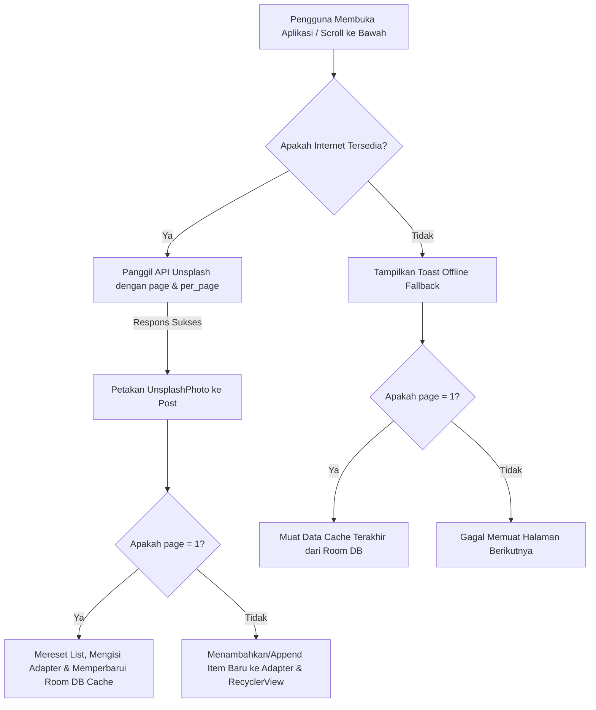

# 📸 Instagram Clone - Lab Mobile Application

Aplikasi Android native yang dirancang sebagai replika fungsional Instagram. Proyek ini mengintegrasikan navigasi modern, manajemen cache offline menggunakan **Room Database**, pengambilan data real-time menggunakan **Retrofit** dari **Unsplash API**, pemrosesan gambar efisien dengan **Glide** (termasuk dynamic image resizing), fitur **Infinite Scroll (Pagination)** pada halaman Home & Explore, serta integrasi **Android 13 Photo Picker API** untuk pembaruan profil pengguna.

---

## 🌟 Fitur Utama

### 1. 🏠 Home Feed dengan Cache Offline & Infinite Scroll
* **Integrasi Unsplash API**: Mengambil data postingan secara real-time dari REST API publik **Unsplash** (`https://api.unsplash.com/photos`) menggunakan Retrofit dan Access Key yang sah.
* **Infinite Scroll (Pagination)**: Mendeteksi ketika pengguna menggulir halaman hingga ke bagian bawah menggunakan `RecyclerView.OnScrollListener` untuk memuat data halaman berikutnya (`page++`) secara otomatis dan asinkron.
* **Offline Caching (Room Database)**: Menyimpan data postingan halaman pertama (page 1) ke Room Database lokal. Database akan diperbarui secara otomatis setiap kali halaman pertama berhasil dimuat ulang secara online.
* **Mekanisme Fallback Offline**: Jika koneksi internet terputus, aplikasi mendeteksi kegagalan jaringan, menampilkan Toast, dan memuat data cache terakhir dari Room Database lokal agar pengguna tetap dapat berinteraksi secara offline.
* **Refresh Manual**: Tombol penyegaran (Refresh) muncul secara dinamis ketika terjadi gangguan jaringan untuk memicu pengambilan data ulang dari halaman pertama.

### 2. 🔍 Grid Explore dengan Infinite Scroll & Clickable Posts
* **Grid Layout 3 Kolom**: Menampilkan kisi foto dengan layout 3 kolom (`GridLayoutManager`) yang dirancang menyerupai halaman Explore Instagram asli.
* **Infinite Scroll (Pagination)**: Mendukung pemuatan halaman explore tanpa batas secara mulus saat pengguna men-scroll ke bawah.
* **Clickable Detail Redirection**: Gambar di halaman Explore dapat diklik untuk membuka halaman **PostDetailActivity**. Data gambar resolusi tinggi (600x600 px), foto profil (100x100 px), nama pembuat, dan takarir (caption) akan dimuat secara dinamis melalui Glide.

### 3. 👤 Profil Pengguna Dinamis
* **Statistik Akun**: Menampilkan jumlah postingan, pengikut (followers), dan mengikuti (following).
* **Penyimpanan Lokal (SharedPreferences)**: Nama, nama pengguna (username), biografi (bio), jenis kelamin (gender), dan foto profil disimpan secara lokal di SharedPreferences, sehingga perubahan tetap tersimpan meskipun aplikasi ditutup dan dibuka kembali.
* **Bagikan Profil**: Fitur berbagi profil menggunakan Android Intent Chooser untuk membagikan tautan profil ke aplikasi perpesanan atau media sosial lain.
* **Simulasi Highlight**: Navigasi interaktif ke sorotan cerita (story highlight) dengan feedback instan.

### 4. ✏️ Edit Profil & Photo Picker Modern
* **Android 13 Photo Picker**: Menggunakan API pemilih media modern (`PickVisualMedia`) yang aman dan efisien untuk memilih foto profil baru dari galeri ponsel tanpa memerlukan izin penyimpanan global yang luas.
* **Izin Akses URI Permanen**: Menggunakan `takePersistableUriPermission` agar URI foto yang dipilih dari galeri eksternal tetap dapat dibaca secara permanen oleh aplikasi setelah dimuat ulang.
* **Formulir Edit Fleksibel**: Layar pengeditan modular (`EditFieldActivity`) untuk mengganti Nama, Username, Bio, dan Jenis Kelamin secara real-time.

### 5. 🖼️ Detail Postingan Dinamis & Fleksibel
* Halaman detail postingan (`PostDetailActivity`) yang terintegrasi penuh untuk menampilkan gambar penuh (600x600 px), foto profil pemilik (100x100 px), username, serta takarir (caption).
* **Glide Network Loading**: Mendukung pemuatan gambar dinamis berbasis jaringan internet (untuk postingan Home Feed & Explore) serta gambar statis berbasis resource lokal drawable (untuk postingan profil).

---

## 🛠️ Tech Stack & Dependencies

Proyek ini dibangun menggunakan teknologi native Android terbaru:

* **Bahasa Pemrograman**: Java 11
* **Arsitektur/Layout**: XML View (ConstraintLayout, RecyclerView, EdgeToEdge)
* **Android SDK**: Compile & Target SDK `36` (Android 15+), Min SDK `24` (Android 7.0)
* **Dependensi Utama**:
  * **Retrofit (v2.11.0)** & **Gson Converter**: Melakukan panggilan REST API networking ke Unsplash secara asinkron.
  * **Room Database (v2.6.1)**: Persistensi data lokal (Cache Offline) untuk postingan Feed utama.
  * **Glide (v4.16.0)**: Mengunduh, mengompres, melakukan caching memori, dan merender gambar secara efisien.
  * **Jetpack Navigation Component (v2.8.5)**: Mengelola navigasi antar Fragment dengan Single Activity Pattern.
  * **Material Components (v1.13.0)**: Memanfaatkan widget modern seperti `ShapeableImageView` untuk foto profil melingkar.

---

## 📂 Struktur Proyek

Berikut adalah direktori kode sumber utama di dalam direktori `app/src/main/java/com/example/lab_mobile`:

```text
com.example.lab_mobile
│
├── 📁 adapters
│   ├── ExploreAdapter.java   # Adapter RecyclerView untuk Grid Explore (mendukung item click listener & append data)
│   └── PostAdapter.java      # Adapter RecyclerView untuk Home Feed (mendukung append data)
│
├── 📁 database
│   ├── AppDatabase.java      # Singleton Room Database (instagram_db)
│   └── PostDao.java          # Data Access Object (DAO) untuk query tabel 'posts'
│
├── 📁 models
│   ├── Post.java             # Entity database Room & representasi model utama aplikasi (dengan dynamic Imgix resize)
│   └── UnsplashPhoto.java    # Model parsing respons JSON Unsplash API & adapter pemetaan ke Post Entity
│
├── 📁 network
│   ├── ApiService.java       # Interface Endpoint Retrofit (GET /photos dengan pagination support)
│   └── RetrofitClient.java   # Konfigurasi Singleton Retrofit Builder ke api.unsplash.com & Access Key
│
├── AppData.java              # Menyimpan model statis awal profil pengguna
├── EditFieldActivity.java    # Layar edit teks modular (Nama, Username, Bio, dll.)
├── ExploreFragment.java      # Fragment grid Explore (dengan OnScrollListener & penanganan navigasi ke detail)
├── HomeFragment.java         # Fragment Home Feed (dengan OnScrollListener, sinkronisasi DB cache & offline fallback)
├── MainActivity.java         # Single Activity utama yang mengontrol BottomNavigationView
├── NextActivity.java         # Layar edit profil utama yang mengintegrasikan Photo Picker
├── PostDetailActivity.java   # Layar detail postingan yang mendukung pemuatan dari drawable lokal & URL internet
├── UserProfile.java          # Kelas model data untuk profil pengguna (Nama, Username, Bio, statistik)
└── ProfileFragment.java      # Fragment profil utama dengan persistensi SharedPreferences
```

---

## 🔄 Alur Kerja Sistem (Workflow Cache Offline & Infinite Scroll)

Diagram berikut menjelaskan bagaimana aplikasi mengelola sinkronisasi data feed postingan antara Unsplash API, penyimpanan lokal Room DB, dan pagination:



---

## ⚙️ Cara Menjalankan Proyek

### 1. Prasyarat
* Android Studio (versi Ladybug atau yang lebih baru direkomendasikan).
* Java Development Kit (JDK) 11 atau yang lebih baru.
* Emulator Android atau perangkat fisik dengan minimal Android Nougat (API 24).

### 2. Kloning dan Build
1. Buka Android Studio.
2. Pilih **File > New > Project from Version Control...** atau kloning proyek ini secara lokal:
   ```bash
   git clone <repository-url>
   ```
3. Tunggu hingga Gradle melakukan sinkronisasi dependensi secara otomatis (membutuhkan koneksi internet).
4. Klik tombol **Run** (segitiga hijau) di toolbar atas Android Studio untuk mengompilasi dan menginstal aplikasi ke perangkat.

---

## 📝 Catatan Tambahan
* **Dynamic Image Resizing (Imgix)**: Untuk meminimalkan konsumsi RAM pada perangkat seluler, aplikasi ini memanfaatkan parameter pemrosesan gambar dinamis bawaan Unsplash (`w`, `h`, `fit=crop`). Sebagai contoh, ukuran gambar postingan diatur menjadi 600x600 px, gambar thumbnail explore sebesar 300x300 px, dan gambar profil mini sebesar 100x100 px.
* **Mock Data**: Dikarenakan data Unsplash tidak menyediakan takarir (caption) bawaan, deskripsi postingan atau takarir disimulasikan menggunakan generator teks caption yang realistis dan deterministik berdasarkan ID gambar.
* **Perizinan Galeri**: Aplikasi menggunakan Android Photo Picker terbaru, sehingga tidak ada izin sistem manual yang diperlukan dari sisi pengguna (meningkatkan keamanan dan privasi perangkat).
