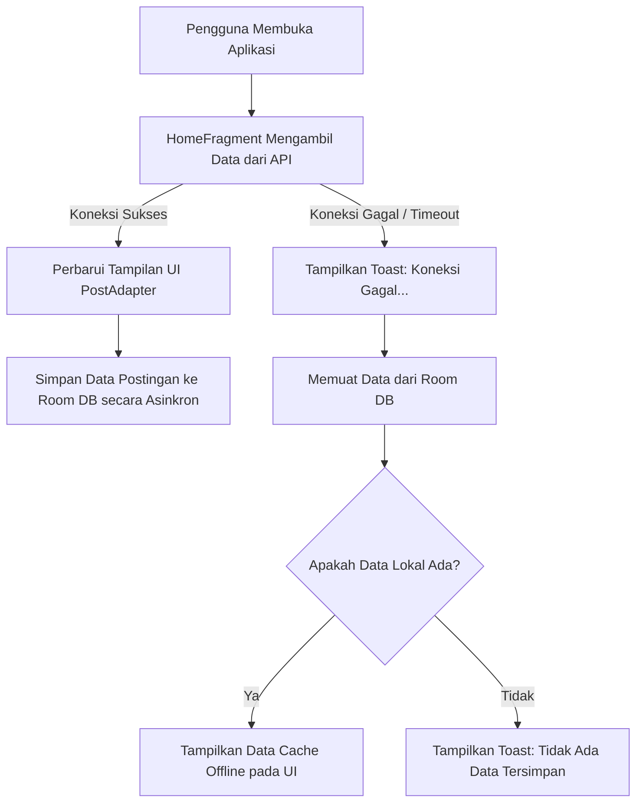

# 📸 Instagram Clone - Lab Mobile Application

Aplikasi Android native yang dirancang sebagai replika fungsional Instagram. Proyek ini mengintegrasikan navigasi modern, manajemen cache offline menggunakan **Room Database**, pengambilan data real-time menggunakan **Retrofit**, pemrosesan gambar efisien dengan **Glide**, serta integrasi **Android 13 Photo Picker API** untuk pembaruan profil pengguna.

---

## 🌟 Fitur Utama

### 1. 🏠 Home Feed dengan Cache Offline
* **Integrasi API**: Mengambil data postingan secara real-time dari REST API publik Picsum Photos (`https://picsum.photos/v2/list`) menggunakan Retrofit.
* **Offline Caching (Room Database)**: Setiap kali data berhasil diambil dari API, data tersebut langsung disimpan ke Room Database lokal.
* **Mekanisme Fallback Offline**: Jika koneksi internet terputus, aplikasi secara otomatis mendeteksi kegagalan jaringan, menampilkan notifikasi Toast, dan memuat data terakhir dari Room Database lokal agar pengguna tetap dapat berinteraksi secara offline.
* **Refresh Manual**: Tombol penyegaran (Refresh) akan muncul secara dinamis ketika terjadi gangguan jaringan untuk memicu pengambilan data ulang.

### 2. 🔍 Grid Explore
* Menampilkan grid foto dengan layout 3 kolom (`GridLayoutManager`) yang dirancang menyerupai halaman Explore Instagram asli.
* Menggunakan **Glide** untuk mengunduh gambar secara efisien dan cepat melalui fungsi resizing gambar dinamis dari Picsum API.

### 3. 👤 Profil Pengguna Dinamis
* **Statistik Akun**: Menampilkan jumlah postingan, pengikut (followers), dan mengikuti (following).
* **Penyimpanan Lokal (SharedPreferences)**: Nama, nama pengguna (username), biografi (bio), jenis kelamin (gender), dan foto profil disimpan secara lokal di SharedPreferences, sehingga perubahan tetap tersimpan meskipun aplikasi ditutup dan dibuka kembali.
* **Bagikan Profil**: Fitur berbagi profil menggunakan Android Intent Chooser untuk membagikan tautan profil ke aplikasi perpesanan atau media sosial lain.
* **Simulasi Highlight**: Navigasi interaktif ke sorotan cerita (story highlight) dengan feedback instan.

### 4. ✏️ Edit Profil & Photo Picker Modern
* **Android 13 Photo Picker**: Menggunakan API pemilih media modern (`PickVisualMedia`) yang aman dan efisien untuk memilih foto profil baru dari galeri ponsel tanpa memerlukan izin penyimpanan global yang luas.
* **Izin Akses URI Permanen**: Menggunakan `takePersistableUriPermission` agar URI foto yang dipilih dari galeri eksternal tetap dapat dibaca secara permanen oleh aplikasi setelah dimuat ulang.
* **Formulir Edit Fleksibel**: Layar pengeditan modular (`EditFieldActivity`) untuk mengganti Nama, Username, Bio, dan Jenis Kelamin secara real-time.

### 5. 🖼️ Detail Postingan
* Halaman detail postingan (`PostDetailActivity`) yang menampilkan gambar penuh, foto profil pemilik, username, serta takarir (caption) postingan.

---

## 🛠️ Tech Stack & Dependencies

Proyek ini dibangun menggunakan teknologi native Android terbaru:

* **Bahasa Pemrograman**: Java 11
* **Arsitektur/Layout**: XML View (ConstraintLayout, RecyclerView, EdgeToEdge)
* **Android SDK**: Compile & Target SDK `36` (Android 15+), Min SDK `24` (Android 7.0)
* **Dependensi Utama**:
  * **Retrofit (v2.11.0)** & **Gson Converter**: Untuk melakukan REST API networking.
  * **Room Database (v2.6.1)**: Untuk persistensi data lokal (Cache Offline) dengan skema versi 2.
  * **Glide (v4.16.0)**: Untuk mengunduh, membuat cache memori, dan merender gambar secara asinkron.
  * **Jetpack Navigation Component (v2.8.5)**: Mengelola perpindahan Fragment dengan Single Activity Pattern.
  * **Material Components (v1.13.0)**: Memanfaatkan widget modern seperti `ShapeableImageView` untuk foto profil melingkar.

---

## 📂 Struktur Proyek

Berikut adalah struktur kode sumber utama di dalam direktori `app/src/main/java/com/example/lab_mobile`:

```text
com.example.lab_mobile
│
├── 📁 adapters
│   ├── ExploreAdapter.java   # Adapter RecyclerView untuk Grid halaman Explore
│   └── PostAdapter.java      # Adapter RecyclerView untuk Home Feed (dengan dummy username & likes)
│
├── 📁 database
│   ├── AppDatabase.java      # Singleton Room Database (instagram_db)
│   └── PostDao.java          # Data Access Object (DAO) untuk query tabel 'posts'
│
├── 📁 models
│   └── Post.java             # Entity database Room & model mapping untuk JSON API Response
│
├── 📁 network
│   ├── ApiService.java       # Interface Endpoint Retrofit (GET /v2/list)
│   └── RetrofitClient.java   # Konfigurasi Singleton Retrofit Builder (https://picsum.photos)
│
├── AppData.java              # Menyimpan model statis awal profil pengguna
├── EditFieldActivity.java    # Layar edit teks modular (Nama, Username, Bio, dll.)
├── ExploreFragment.java      # Fragment untuk menampilkan grid Explore
├── HomeFragment.java         # Fragment Home Feed dengan mekanisme sinkronisasi data online-offline
├── MainActivity.java         # Single Activity utama yang mengontrol BottomNavigationView
├── NextActivity.java         # Layar edit profil utama yang mengintegrasikan Photo Picker
├── PostDetailActivity.java   # Layar detail postingan saat salah satu foto di klik
├── UserProfile.java          # Kelas model data untuk profil pengguna (Nama, Username, Bio, statistik)
└── ProfileFragment.java      # Fragment profil utama dengan persistensi SharedPreferences
```

---

## 🔄 Alur Kerja Sistem (Workflow Cache Offline)

Diagram berikut menjelaskan bagaimana aplikasi mengelola sinkronisasi data feed postingan antara REST API dan penyimpanan lokal Room DB:



---

## ⚙️ Cara Menjalankan Proyek

### 1. Prasyarat
* Android Studio (versi Ladybug atau yang lebih baru direkomendasikan).
* Java Development Kit (JDK) 11 atau yang lebih baru.
* Emulator Android atau perangkat fisik dengan minimal Android Nougat (API 24).

### 2. Kloning dan Build
1. Buka Android Studio.
2. Pilih **File > New > Project from Version Control...** atau kloning proyek ini secara lokal:
   ```bash
   git clone <repository-url>
   ```
3. Tunggu hingga Gradle melakukan sinkronisasi dependensi secara otomatis (membutuhkan koneksi internet).
4. Klik tombol **Run** (segitiga hijau) di toolbar atas Android Studio untuk mengompilasi dan menginstal aplikasi ke perangkat.

---

## 📝 Catatan Tambahan
* **Mock Data**: Karena API Picsum Photos tidak menyertakan username dan takarir (caption), nama pengguna di-generate secara dinamis dari nama asli fotografer (author) Picsum, sedangkan takarir dan jumlah suka (likes) di-generate secara realistis dan deterministik.
* **Perizinan Galeri**: Dikarenakan aplikasi menggunakan Android Photo Picker terbaru, tidak ada izin sistem manual yang diperlukan dari sisi pengguna, sehingga meningkatkan kenyamanan dan keamanan privasi.
